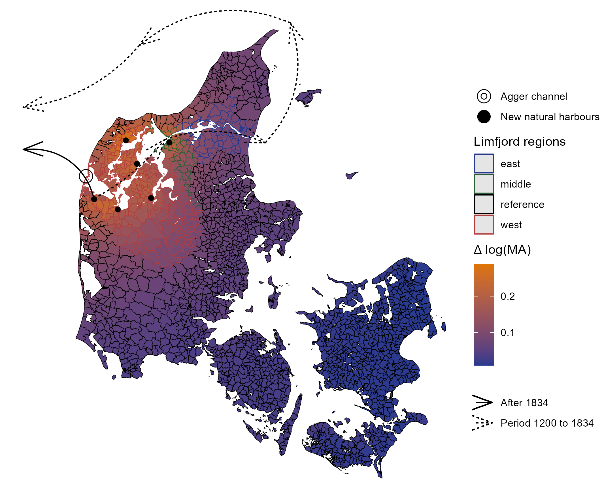

# A Perfect Storm: First-Nature Geography and Economic Development

This is the public repository of *A Perfect Storm: First-Nature Geography and Economic Development* by *Christian Vedel (University of Southern Denmark)*

The paper tests the effect of changing first-nature geography on economic development using a storm in 1825, which fundamentally changed the geomorphology of the Limfjord region of Denmark. 

$\rightarrow$ [Full paper on arXiv](https://arxiv.org/abs/2408.00885)  
$\rightarrow$ [Slides](https://raw.githack.com/christianvedels/A_perfect_storm/main/Slides/slides.html)  
$\rightarrow$ [YouTube video](https://youtu.be/f7Xo7BO_Xqk)


<details>
  <summary>How to cite (click to expand)</summary>

  > Vedel, C. (2024). A Perfect Storm: First-Nature Geography and Economic Development. [arxiv.org/abs/2408.00885](https://arxiv.org/abs/2408.00885)
  
  ```bibtex
  @misc{vedel2024perfectstormfirstnaturegeography,
      title={A Perfect Storm: First-Nature Geography and Economic Development}, 
      author={Christian Vedel},
      year={2024},
      eprint={2408.00885},
      archivePrefix={arXiv},
      primaryClass={econ.GN},
      url={https://arxiv.org/abs/2408.00885}, 
}
  ```
</details>



-------------

The scripts in this repository are numbered to indicate the order in which to run them. Some of the data cannot be shared in this repository either because I am not authorized to redistribute it, or because it is too large. However, I have included all the necessary information to download or obtain the data below. All scripts from "101\_..." onwards require only data that is included in the repository.

The numbering of the scripts indicate running order. The first digit indicate level of analysis. Everything starting with 0, e.g. 002_Linking_geo_data.R processes raw data. Everything starting with the digit 1 are scripts intended to output data which is used in the analysis. Scripts starting with 2 outputs results which are found in the paper or appendix.


## 1. Included data

The following data is included in this repository

### A. Popdata.csv

This contains demographic data at the parish level. The data contains the following variables:

| Variable              | Description                                                                                              |
|-----------------------|----------------------------------------------------------------------------------------------------------|
| Year                  | Census year                                                                                              |
| GIS_ID                | Unique identifier for each parish, which links to the shape data                                         |
| Pop                   | Population in parish                                                                                     |
| Age\_[x]\_[y]         | People in age group x \<= age \<= y                                                                      |
| Born_different_county | Number of people born in a different county                                                              |
| hisco_1st_digit[x]    | Number of people with first digit of their HISCO code [x]. See <https://historyofwork.iisg.nl/major.php> |
| hisco_2nd_digit[x]    | Number of people with the two first digits of their HISCO code [x]. See <https://historyofwork.iisg.nl/major.php> |
| hisco_3rd_digit[x]    | Number of people with the three first digits of their HISCO code [x]. See <https://historyofwork.iisg.nl/major.php> |
| prime_labor_age       | Number of people of prime working age (between 25 to 54 years)                                           |
| occupation_in_prime   | Number of people with a HISCO code in prime working age (between 25 to 54 years)                         |
| consistent            | Dummy for parishes which are consistently observed across all years (1590 parishes)                      |

Each variables also has an equivalently named counterpart with suffix "\_f" and "\_m" for female/male part of the population. The suffix "\_migr" are for people born in a different county than where the currently live.

### B. sogne_shape

'Sogne' tranlates to parishes. This is the shape file of Danish parishes as of January 1, 1820. Which was passed on to me from the authors of Boberg-Fazlic et al (2023). Originally this comes from www.digdag.dk. The market town of Lemvig (which is important in this application) was missing and added manually using borders downloaded directly from www.digdag.dk. The shape file has a an associated dataframe, which contains the following variables:

| Variable | Description                                                                                                                        |
|--------------------------------|----------------------------------------|
| STEDNR   | ID used by digdag                                                                                                                  |
| SOGN     | Name of the parish                                                                                                                 |
| HERRED   | The herred in which the parish is located. Administrative division above parish and below county. Roughly translates to 'hundred'. |
| AMT      | County of the the parish.                                                                                                          |
| GIS_ID   | Unique identified used in this project.                                                                                            |
| long     | Longitude of the centroid of the parish                                                                                            |
| lat      | Latitude of the centroid of the parish                                                                                             |

### C. Key_census_to_shape.csv

Key linking the census data to the shape data.

| Variable       | Description                                                                                                                        |
|--------------------------------|----------------------------------------|
| event_parish   | The parish                                                                                                                         |
| event_district | The herred in which the parish is located. Administrative division above parish and below county. Roughly translates to 'hundred'. |
| event_county   | The county of the parish.                                                                                                          |
| GIS_ID         | GIS_ID - unique ID in the shape data.                                                                                              |

### D. limfjorden

Shape file which covers the body of water known as Limfjorden. Copied from this repository: <https://github.com/DenAutonomePirat/shapefile>

### E. Geo.csv

This contains various geographic information. The variables *main, coastal, non_limfjord_control, wo_kbh* are booleans, which can be used to filter with to investigate sensitivity to different subgroups of the data.

| Variable             | Description                                                                                           |
|--------------------------------|----------------------------------------|
| County               | County of the parish                                                                                  |
| Parish               | Parish name                                                                                           |
| GIS_ID               | GIS_ID - unique ID in the parish shape data.                                                          |
| long                 | Longitude of the centroid of the parish                                                               |
| lat                  | Latitude of the centroid of the parish                                                                |
| limfjord_placement   | Does the parish belong the Limfjord area of Denmark? And which part of the Limfjord? West/middle/east |
| distance_oce         | Distance to closest coast in meters                                                                   |
| distance_lim         | Distance to the Limfjord in meters                                                                    |
| main                 | All data                                                                                              |
| coastal              | Only parishes with \<5km distance to a coast                                                          |
| non_limfjord_control | All parishes, which are not on the Limfjord are at least 100 km away from the Limfjord                |
| wo_kbh               | Copenhagen and the county just north of it (Frederiksborg) is excluded                                |

The Limfjord placement is based on the following definitions: - The parish is categorized as being a Limfjord parish, if the closest coast is the Limfjord i.e. distance_oce \>= distance_lim-200 - The parish is categorized into west, middle or east Limfjord, depending on whether it is generally west or east of the middle Limfjord.\
- The middle Limfjord is everything within 20 km of a line defined by (57.044185 9.186837), (56.958951 9.275585). The west is west of this and vice versa for the east.

### F. Top100_HISCO.csv

Top 100 HISCO codes with categories

| Variable      | Description                                            |
|---------------|--------------------------------------------------------|
| hisco         | HISCO codes                                            |
| n             | Number of people with that occupation across 1787-1901 |
| en_hisco_text | English description                                    |
| Category      | Manual category of the occupation                      |

### G. LocalSoundToll.csv

This contains summarised ship traffic from the sound toll registers. See <http://www.soundtoll.nl/index.php/en/>

| Variable           | Description                                                |
|--------------------------------|----------------------------------------|
| Year               | Year of the observed trafic                                |
| port               | Name of port                                               |
| limfjord_placement | Which part if any of the Limfjord does the port belong to? |
| n_from             | Ship trafic with that port as destination                  |
| n_to               | Ship trafic with that port as origin                       |
| traffic            | Sum of n_from and n_to                                     |
| decLatitude        | Latitude of the port                                       |
| decLongitude       | Longitude of the port                                      |

### H. Market_towns.csv

This data was manually compiled based on the following wikipedia page: <https://da.wikipedia.org/wiki/K%C3%B8bst%C3%A6der_i_Danmark>

The data was enriched with data from Degn (1989) and www.ddb.byhistorie.dk

| Variable            | Description                                                            |
|--------------------------------|----------------------------------------|
| Market_town         | Name of market town                                                    |
| Market_townID       | Unique ID for each market town                                         |
| Pop1672             | Population in 1672                                                     |
| Pop1769             | Population in 1769                                                     |
| Pop1787             | Population in 1787                                                     |
| Pop1801             | Population in 1801                                                     |
| GIS_ID              | Key to use for census data and shape data. Manually added              |
| Coastal             | Is the market town close to the coast?                                 |
| Limfjord_coast      | Is the market town on the Limfjord?                                    |
| Manually_added      | Not in Degn (1989). Was added from ddb.byhistorie.dk                   |
| wiki_ref            | Wikipedia URL                                                          |
| Coord               | Latitude and longitude from wikipedia                                  |
| Privilege_start     | When was market town privilege given?                                  |
| Privilege_end       | When was market town privilege taken away?                             |
| Informal_markettown | Towns that in all but official recognition acted as market town        |
| Approx_year         | Is the privilege given in an approximate year?                         |
| Port_projects       | Years separated by ','. Year of port construction projects from Trap 3 |
| ddb_url             | Page on ddb.byhistorie.dk                                              |
| Notes               | Notes                                                                  |

### I. MA_estimates.csv

This contains Market Access estimates before and after the channel. When the channel opened six new ports became available. The data in this file measures market access in a standard Harris (1954) inspired fashion as the sum of inverse distance to ports. This is based on ports from the sound toll register. The file contains estimates given the combination of a wide set of feasible parameters. This is stored in the long format.

The market access is computed as:

$${MA}_p = \sum_{h \in H} [CostDist(p, h) + 1]^\theta$$

Here $H$ is the set of all available ports (H for harbour). $h$ is a specific port and $p$ is a specific parish. $CostDist(p, h; \alpha)$ is the relative cost of travelling from parish $p$ to port $h$. Here $\alpha$ is the relative cost of travelling over sea rather than land. In the default specification $\alpha = 10$ is used. $\theta$ is the distance elasticity. In the default specification $\theta=-1$ is used (just like Harris, 1954).

The core aim of this entire exercise is to gain insights into how this measure changes with the breach namely ${MA}_p|No\:canal$ and ${MA}_p|Canal$. This comes from the change in the set of available ports $H\rightarrow H^*$. $H$ is all the consistently available ports before 1834. $H^*$ is those consistently available after 1834. The estimated conditional market access can then be expressed as

$$
\begin{split}
{MA}_{p}|No\:channel &= {MA}_{p}|H \\
{MA}_{p}|Channel &= {MA}_{p}|H^*.
\end{split}
$$

| Variable        | Description                                         |
|-----------------|-----------------------------------------------------|
| GIS_ID          | GIS_ID - unique ID in the parish shape data.        |
| MA_before       | Market access before the new ports became available |
| MA_after        | Market access after the new ports became available  |
| MA_after_before | Market access improvement: MA_after / MA_before     |
| theta           | Assumed $\theta$ (distance elasticity)              |
| alpha           | Assumed $\alpha$ (relative cost of land travel)     |

Maps given these MA estimates can be found in the path *Plots/MA plots*.

### J. Arch.csv

| Variable                  | Description                                                                                                                    |
|--------------------------------|----------------------------------------|
| GIS_ID                    | GIS_ID - unique ID in the parish shape data.                                                                                   |
| finding_interpretation    | Finding interpretation in Danish                                                                                               |
| finding_interpretation_en | Finding interpretation in English                                                                                              |
| From_year                 | Dating range - first plausible year                                                                                            |
| To_year                   | Dating range - last plausible year                                                                                             |
| Category                  | Overall category of the finding: *Indicators_of_economic_activity, Buildings, State_formation, Religious, Defensive, Distress* |

### K. Reg_arch_buildings.csv, Reg_arch_coins.csv

Regression data for arcaehological data based on monte carlo sampling from 009_Archaeological_monte_carlo.R. Reg_arch_buildings.csv contains data for buildings. Reg_arch_coins.csv contain data from coin findings.

| Variable                         | Description                                                                                                           |
|--------------------------------|----------------------------------------|
| GIS_ID                           | GIS_ID - unique ID in the parish shape data.                                                                          |
| rYear                            | Year. The r indicates that the year is stochastic since it ultimately comes from the uncertain dating of the findings |
| activity                         | Estimated probability that there was activity (coins or buildings) in this parish at this time                        |
| [geo]                            | Geographical data from 'Geo.csv'                                                                                      |
| delta_lMA_theta\_[x]\_alpha\_[y] | Difference in market access before/after channel based from MA_estimates.csv with parameters -x and y.                |

### M. Distance_to_market_town.csv

| Variable             | Description                                         |
|--------------------------------|----------------------------------------|
| GIS_ID               | GIS_ID - unique ID for the parish.                  |
| Distance_market_town | Distance to the closest market town centroid        |
| Closest_market_town  | Which market town is closest? Represented by GIS_ID |

### N. Parish_soil.csv

| Variable    | Description                                          |
|-------------|------------------------------------------------------|
| GIS_ID      | GIS_ID - unique ID for the parish.                   |
| SOIL_TYPE   | Soil type from Pedersen et al (2019)                 |
| area_parish | Area of the parish in m\^2                           |
| pct         | How much of this parish is this particular soil type |

### O. Matched_parishes.csv

This contains a data frame of parishes matched on propensity score. The propensity is for the being in the west Limfjord, which is estimated based on PLS propensity scores.

| Variable           | Description                                                                                                                   |
|--------------------------------|----------------------------------------|
| GIS_ID             | All GIS_IDs which have been matched                                                                                           |
| propensity         | Propensity score for these parishes. The predicted probability that they belong to the west Limfjord based on soil type alone |
| limfjord_placement | Position in the Limfjord - 'west' or 'not'                                                                                    |

### P. 1977 Svalgard.csv

This contains data on ship traffic in the Agger channel from Svalgaard (1977)

| Variable    | Description                                 |
|-------------|---------------------------------------------|
| Year        | Year                                        |
| Ships_in    | Ships traveling into the Limfjord          |
| Ships_out   | Ships traveling out of the Limfjord        |
| Ships_total | Total ship traffic                          |
| Channel     | Agger channel or the later Thyborøn channel |
Channel_depth_lower	| Channel depth lower end estimate in feet |
Channel_depth_upper	| Channel depth upper-end estimate  in feet |
Channel_width	      | Channel width in the old Danish unit 'alen' |


## 2. Large or non-redistributable data

These are not available in this repository, either because I am not allowed to redistribute them, or because they are too large.

### A. Danish census data from Link Lives

I use the publicly available from Link Lives, available at www.rigsarkivet.dk/udforsk/link-lives-data/

### B. Sound toll registers online

This database of the Sound Toll Registers is available at <http://www.soundtoll.nl/index.php/en/over-het-project/str-online>. Although you cannot download it directly from the website, you can request a copy of the full database by sending them an email describing your project.

### C. Digdag

The parish borders from 1820 are available in the Digital Atlas of Danish Historical Administrative Geography. You can download it from <https://digdag.dk/>.

### D. Hisco codes for Danish census data

The HISCO codes for the Danish census data are available at Havard Dataverse: https://doi.org/10.7910/DVN/WZILNI  (Vedel, Dahl, Johansen 2024)

### E. Coast-line shape

This is only used in 005_Limfjord_regions.R. It is slightly too large to redistribute. It contains coastlines, and is downloadable from: <https://osmdata.openstreetmap.de/data/water-polygons.html>. This was downloaded on 2023-04-19.

### F. Archaeological data

The archaeological data used can be downloaded from the website of the Danish Agency of Culture and Palaces. They maintain a database of all archaeological sites in Denmark. This data is processed in '008_Archaeological_data.R'.

### G. Soil types shape

This contains the soil types of modern-day Denmark, which were largely determined in the last ice age. See Pedersen et al (2019). It can be downloaded from: <https://www.geus.dk/produkter-ydelser-og-faciliteter/data-og-kort/danske-kort/download-jordartskort>

## Scripts
Here is a short description of each script and its functionality:

| Name                              | Description                                                               |
|-----------------------------------|---------------------------------------------------------------------------|
| `000_Functions.R`                 | Functions used in the rest of the project.                                |
| `001_Read_census_data.R`          | This script reads csv-files containing census data and merges them.       |
| `002_Linking_geo_data.R`          | Link census data with parishes.                                           |
| `003_Occupations_data.R`          | Join on data on HISCO codes and categories.                               |
| `004_Aggregate_demographic_data.R`| Aggregate data to parish level.                                           |
| `005_Limfjord_regions.R`          | Defining Limfjord regions.                                                |
| `006_Sound_toll_data.R`           | Extracting relevant Sound Toll data.                                      |
| `007_Archaeological_data_clean.R` | Cleaning archaeological data.                                             |
| `008_Market_access.R`             | Calculate change in Market Access.                                        |
| `009_Archaeological_monte_carlo.R`| Estimating the location of economic activity with archaeological findings.|
| `010_Distance_to_market_towns.R`  | Computes distances to market towns for each parish.                       |
| `011_Parish_soil.R`               | Find the soil type of each parish.                                        |
| `101_Constructing_arch_reg_data.R`| Construction of regression data for archaeological findings.              |
| `102_Matching_soil_types.R`       | Run matching on soil type.                                                |
| `103_Constructing_pop_reg.R`      | Constructs the population regression data used in the analysis.           |
| `201_Main_map.R`                  | Construct the map showing the event (figure 1).                           |
| `202_Sound_toll_results.R`        | Produces plots and regressions for trade.                                 |
| `203_Pop_results.R`               | Produces plots and regressions for population results.                    |
| `204_Archaeological_results.R`    | Produces plots and regressions for archaeological results.                |
| `205_Pop_mechanism.R`             | Mechanisms results.                                                       |


## References

Boberg-Fazlic, N., Jensen, P.S., Lampe, M. et al. 'Getting to Denmark': the role of agricultural elites for development. J Econ Growth (2023). <https://doi.org/10.1007/s10887-023-09226-8>

Degn, O. (1989). Byer, byhierarkier og byudvikling. Historie/Jyske Samlinger. <https://tidsskrift.dk/historiejyskesamling/article/view/40197>

Harris, C. D. (1954). The Market as a Factor in the Localization of Industry in the United States. Annals of the Association of American Geographers, 44(4), 315--348.

Pedersen, S., Hermansen, B., Nathan, C., & Tougaard, L. (2019). Surface geology map of Denmark 1:200 000, version 2. GEUS. <https://eng.geus.dk/products-services-facilities/data-and-maps/maps-of-denmark>

Svalgaard, R. (1977). Toldvagtskibe ved Agger Kanal samt toldvagtskibet "Thyborøn." Årbog for Thy, Mors Og Vester Hanherred, 35--57. <https://www.arkivthy.dk/images/Aarbog/1977/Svalgaard>, Robert Toldvagtskibet ved Agger kanal samt told.pdf

Vedel, C., Dahl, C. M., Johansen, T. S. D., 2024, "HISCO codes for Danish Census data", https://doi.org/10.7910/DVN/WZILNI, Harvard Dataverse, V3
