```{css echo=FALSE}
.pull-left {
  float: left;
  width: 44%;
}
.pull-right {
  float: right;
  width: 44%;
}
.pull-right ~ p {
  clear: both;
}
```

# Introduction
.pull-left[
- Geography is more than soil quality. We are slaves of geomorphology.  
- In 1825 the Agger isthmus* broke by 1834 a natural channel had formed 
- 700 years prior a similar channel had silted up
- Is infrastructure important in economic development? (Fogel, 1964)

#### What will be demonstrated:
  - The channel caused trade 
  - The channel caused a local population boom
  - Mechanism
  - Evidence for the reverse natural experiment in 1100s

]

.pull-right[
```{r echo=FALSE, out.width="100%", fig.align='center'}
knitr::include_graphics("Figures/1714 Homann - Tabula Generalis lutiae ... www.kb.dk.jpg")
```
*Humann (1750) 'Tabula Generalis Iutia' www.kb.dk*

```{r echo=FALSE, out.width="100%", fig.align='center'}
knitr::include_graphics("Figures/Petersen 1877.png")
```
*Petersen (1877)*

]


???
**3/45**  
- Understanding what causes wealth (wellbeing, etc.) is at the heart of Economics 
- Understanding the interplay between geography (environment) and Economics is vital in the 21st century


---
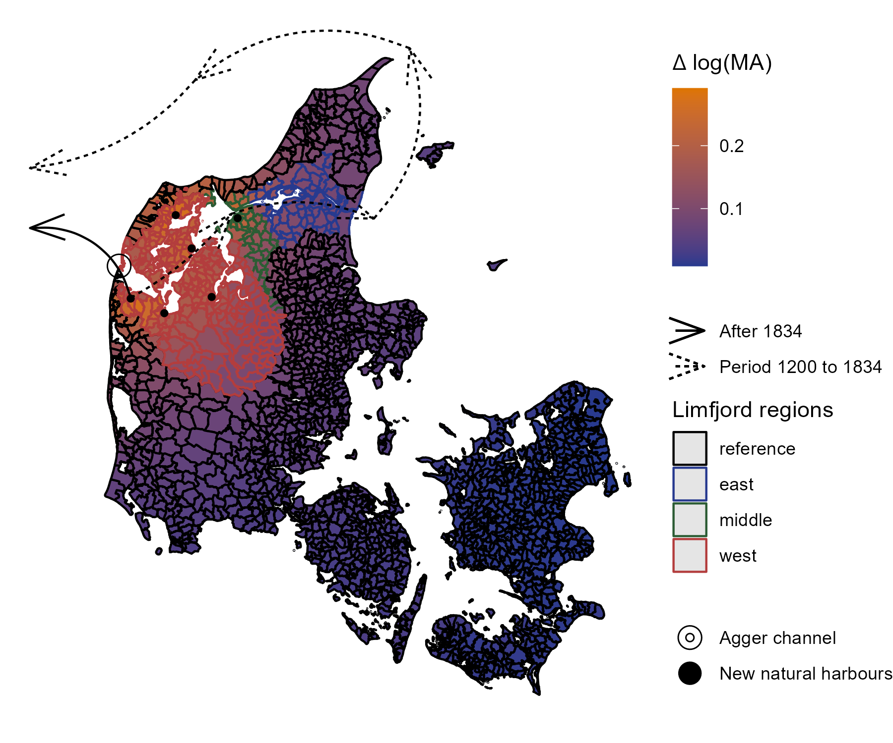

???
- This map essentially shows the entire story I am going to tell you today 

---
# Map
.center[
<iframe src="https://www.google.com/maps/embed?pb=!1m14!1m12!1m3!1d704129.7470425251!2d8.826970647896832!3d56.880787313536544!2m3!1f0!2f0!3f0!3m2!1i1024!2i768!4f13.1!5e1!3m2!1sda!2sdk!4v1634159326111!5m2!1sda!2sdk" width="600" height="450" style="border:0;" allowfullscreen="" loading="lazy"></iframe>
]

---
# Litterature
.pull-left[
- History desribed by Poulsen (2019, 2022)
- Does infrastructure promote regional development? (Fogel, 1964; Bogart, 2009; Donaldson & Hornbeck, 2016; Berger & Enflo, 2017; etc.)
- Does trade cause growth? (Frankel & Romer, 1999; Feyrer, 2021; Pascali, 2017)
- Fundamental determinants of economic wealth: *Institutions or geography?* 
- Pragmatically: Infrastructure is expensive

**Why this case**: 
- Neat natural experiment: No-one decided that a canal should be constructed
]


.pull-right[
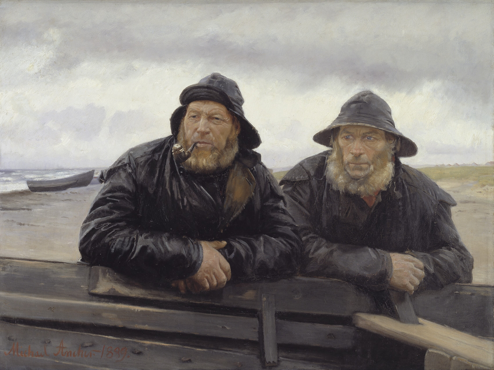
*'Two fishermen by a boat', Anker (1889), smk.dk*  
]

???
**15/45**

---
name: timeline
# Timeline

--

#### Pre-event: 
- 1085-1208: Natural western channel closed because of gradual land rises (since the last ice age)
- 1672: Eastern Limfjord town Aalborg 2nd largest in DK 
- Other Limfjord towns lacked far behind under Aalborg's local hedgemony

--

#### Event:
- 1825: Breach of Agger Isthmus
- 1834: Ships start consistently passing through a new natural channel 
- 1841: Independent trade rights to west Limfjord market towns 
- 1850-1900: [Secondary infrastructure and growth](#post-event) 
- 1860-1900: Strong(er) growth

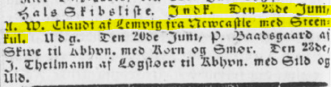

---
# Empirical strategy

$$log(y_{it}) = Affected_i \times Year_t \beta_t + FE + \varepsilon_{it}$$

*Affected is:*
- The **West** Limfjord, or
- Improved **market access** after the breach

---


---
# Market Access
.pull-left[
Based on cost distance from parishes to harbours: 
$${MA}_p = \sum_{h \in H} [CostDist(p, h) + 1]^\theta \times W_{p}$$
- CostDist - Dijkstra's agorithm and 1/10 land/sea ratio 
- $\theta = -1$  
- Breach caused new harbours in West Limfjord: $H\rightarrow H^*$

$$MA_{before} = MA_p|H \\
MA_{after} = MA_p|H^*$$
Main measure:
$$\Delta log(MA) = log(MA_{after})-log(MA_{before})$$
]

.pull-right[

]

---
name: str-presentation
# 1. Trade: Sound Toll Register (STR)

.pull-left[
- Most ships to and from the Baltic region (1.8 mio. passages, 1497-1857) 
- Extract traffic for Denmark  
- Digitized by team at Gronningen (Veluwenkamp & Woude, 2009)
- Only ships passing [Elsinore](#elsinor)
 

*Kronborg at Elsinore anno 1500, wikimedia commons*
]

.pull-right[
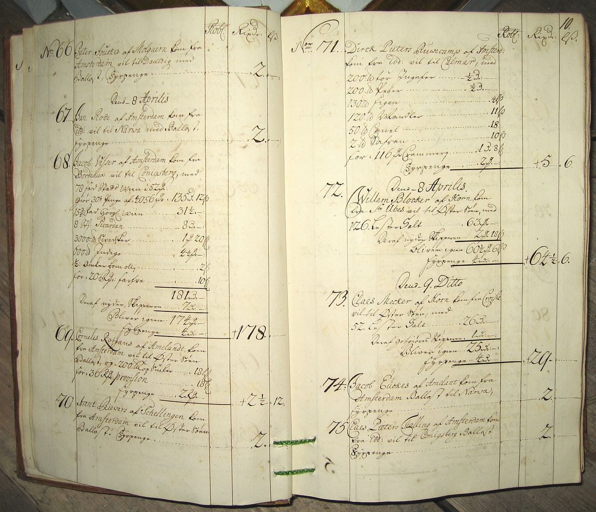
*Page from Sound Toll Register in 1734 (www.rug.nl)*
]

---
name: censusdata

# 2. Population: Census data

.pull-left[
- Danish Demographic Database 
- Individual-level data for the years 1787, 1801, 1834, 1845, 1860, 1870, 1890 and 1901 
- From this: Parish level population counts + occupations 
- New procedure to automatically make [HISCO labels](#hisco)

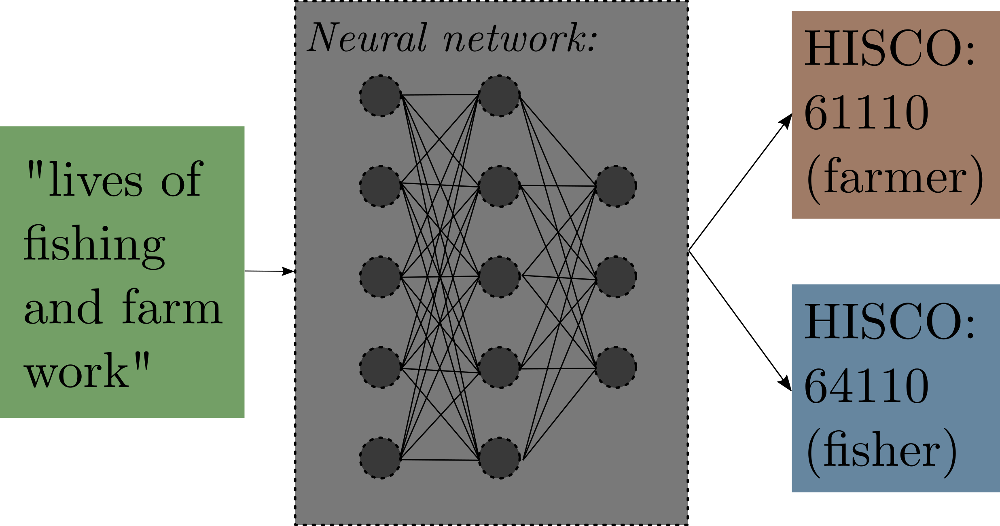
]

.pull-right[
*Census, wikimedia commons*


]

---
# The channel caused trade


*Descriptive statistics from Svalgaard (1977) sourced from customs archives*
---
# The channel caused trade


---
name: str-results
# The channel caused trade
.pull-left[
- **Data**: Panel of Danish ports 1750-1855 
- **Outcome**: Cargo ship traffic with origin or destination in a specified port
- PPML estimator following Silva & Tenreyro (2006) 
- In the order of 400% growth in trade in the region
- Local descriptive trade stats show the same story:
  + From 6 to 62 ships in Thisted harbour (1834-1876)
  + 997% increase in oats export, Thisted (1801-1853) 
]


.pull-right[
```{r echo=FALSE, out.width="100%", fig.align='center'}
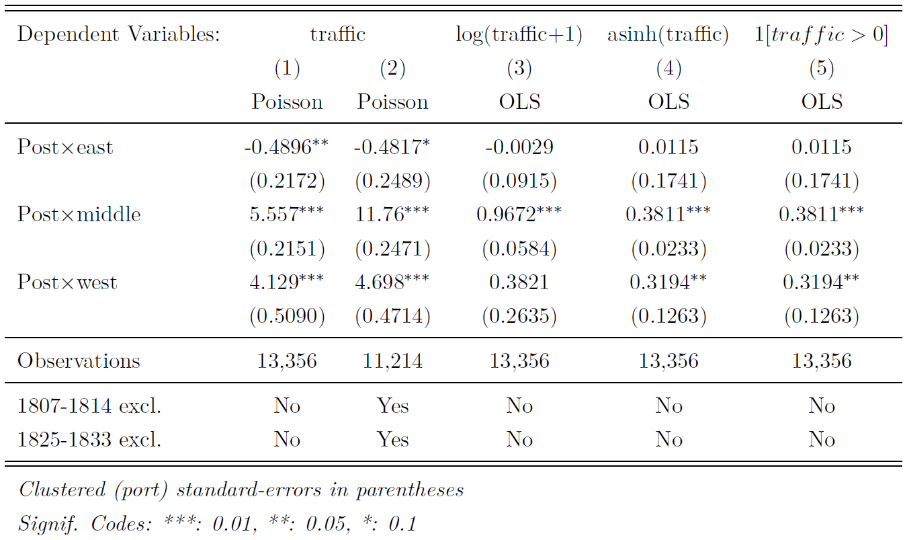
```
*Larger on next page*
]

---
# The channel caused trade
```{r echo=FALSE, out.width="100%", fig.align='center'}

```

---
name: pop
# Population increase

.pull-left[
### Market Access approach
```{r echo=FALSE, out.width="100%", fig.align='center'}
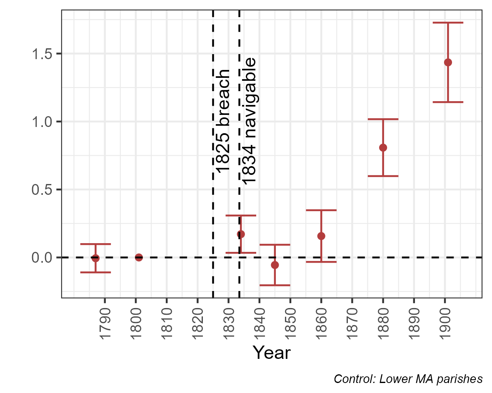
```

**Robustness to:**
- [Comparison groups](#Rob_comp)
- [Parameter choices](#all-paramMA)
]
--
.pull-right[
### Dummy approach
```{r echo=FALSE, out.width="100%", fig.align='center'}
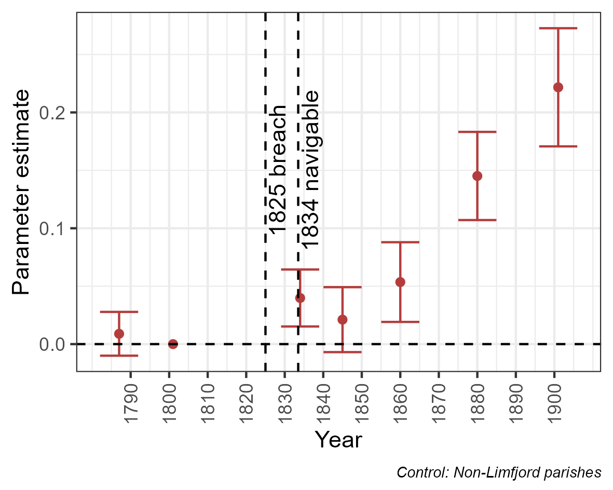
```

**Robustness to:**
- [Comparison groups](#Rob_comp)
- [Pre-treatment characteristics](#pre_treat_adj)

]

???
- Rauch & Maurer (2022): 2.3 for panama canal

---
name: mechanism1
.pull-left[
# Mechanism
- **First-order mechanism:** Trade (as documented)
- **Remaining questions**: 

  + *Why was the take-off relatively slow?* 
  + **Answer:** [Institutions and secondary infrastructure](#instmech) had to adapt

  + *What carried the population growth?* 
  + **Likely answer:** Fertility driven by rise of manufacturing and fishing
]

.pull-right[

*Loading Butter in a Danish port (1924)*

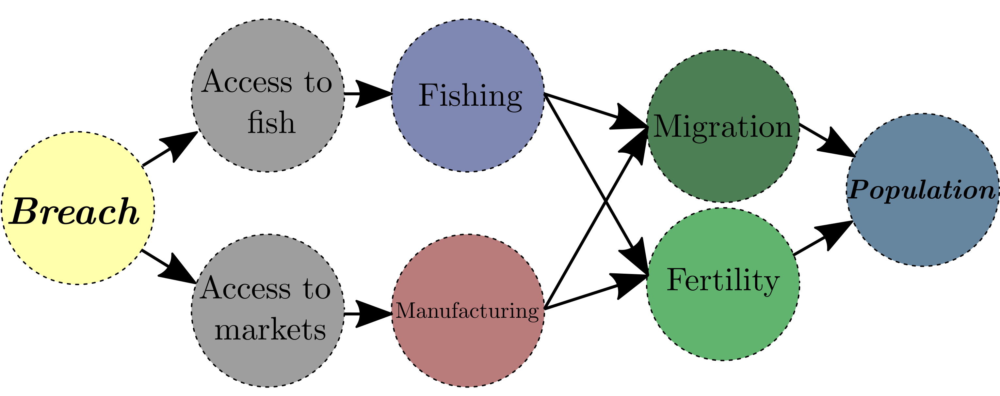
*DAG of the suggested mechanism* 
]


---
.pull-left[
### Part 1
<p style="color:red;">The channel caused fishing and manufacturing:</p>

 
**Fishing:**
```{r echo=FALSE, out.width="100%", fig.align='center'}
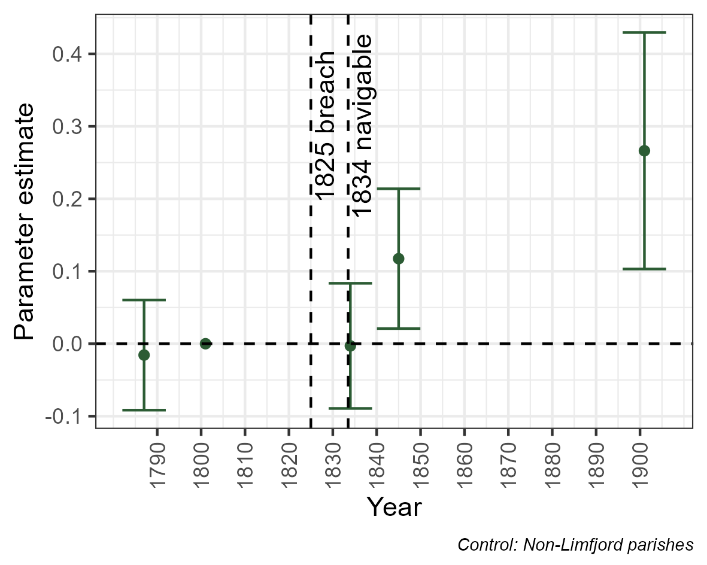
```

]
--
.pull-right[
### Part 2
<p style="color:red;">But only manufacturing can account for the population growth:</p>

**Manufacturing:**
```{r echo=FALSE, out.width="100%", fig.align='center'}
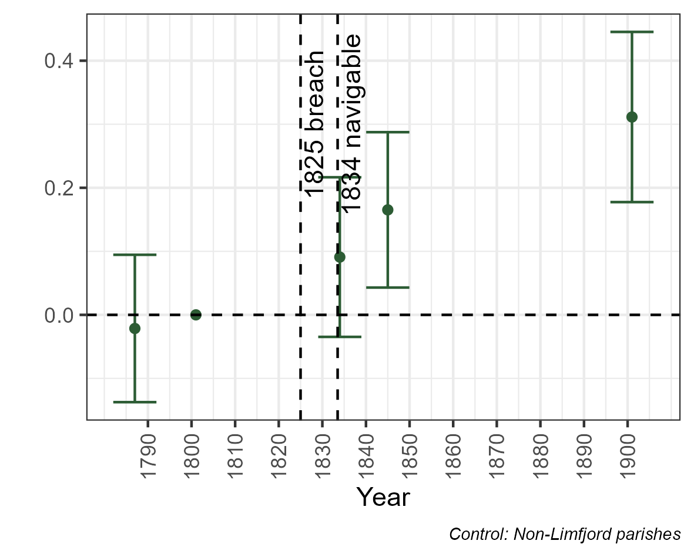
```

]

---
### But can this explain the population growth?

**Labor force as share of total pop:**
```{r echo=FALSE, out.width="70%", fig.align='center'}
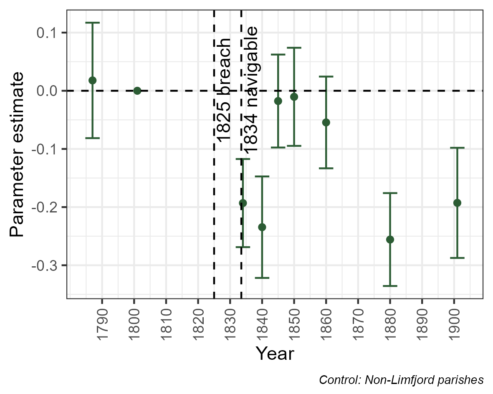
```

---
### Migration and fertility
.pull-left[
**People who live in different county than their birth county:**
```{r echo=FALSE, out.width="100%", fig.align='center'}
knitr::include_graphics("Figures/born_different.png")
```
]
--
.pull-right[
**Child/women ratio (ch. 1-5 years per f. 15-45):**
```{r echo=FALSE, out.width="100%", fig.align='center'}
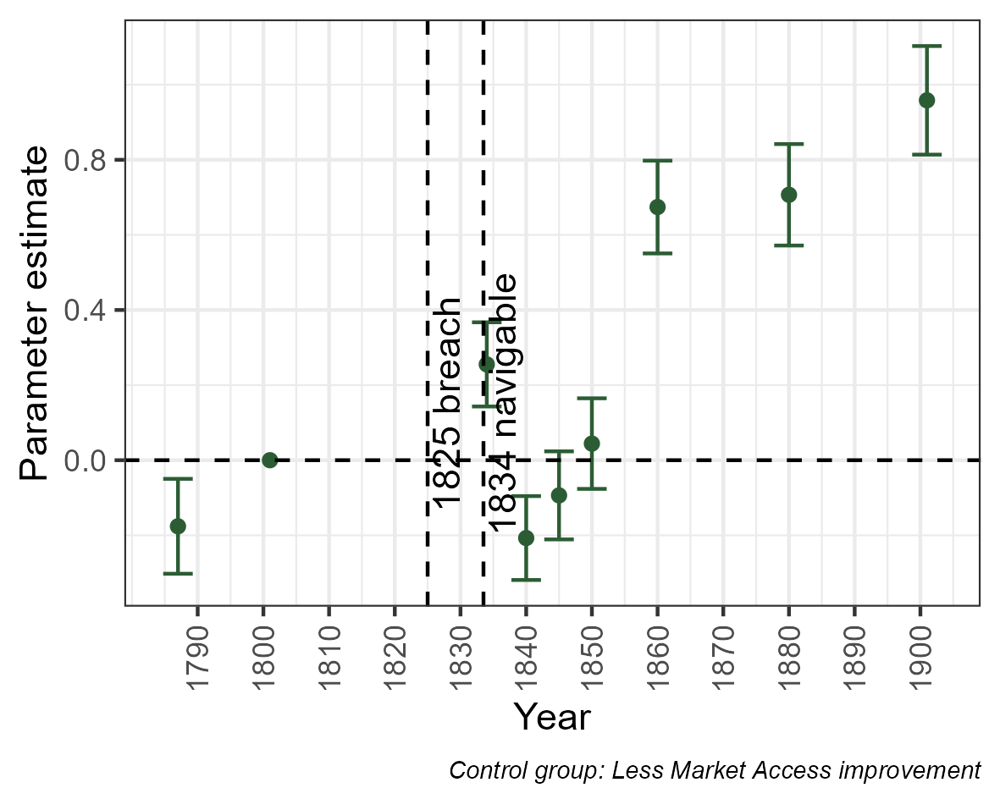
```

]


---
# The reverse natural experiment

.pull-left[ 
- The Limfjord also had a western opening in the Viking age. 
- Ideal hub for viking fleets heading west towards England (Matthiessen 1941; Rasmussen, 1966) 
- Northwestern Denmark in 1100s is very different from ditto in 1800s
- Between 1086 and 1208 the channel silted up (Saxo (1208) + geological sources)

**Data?** 
- Just use register data! 
- New method to construct panel sampling $P(Coin|t)_i$ from dating range based on Bayes and Monte Carlo
]

.pull-right[

*'Overseas Guests', Roerich (1901)*
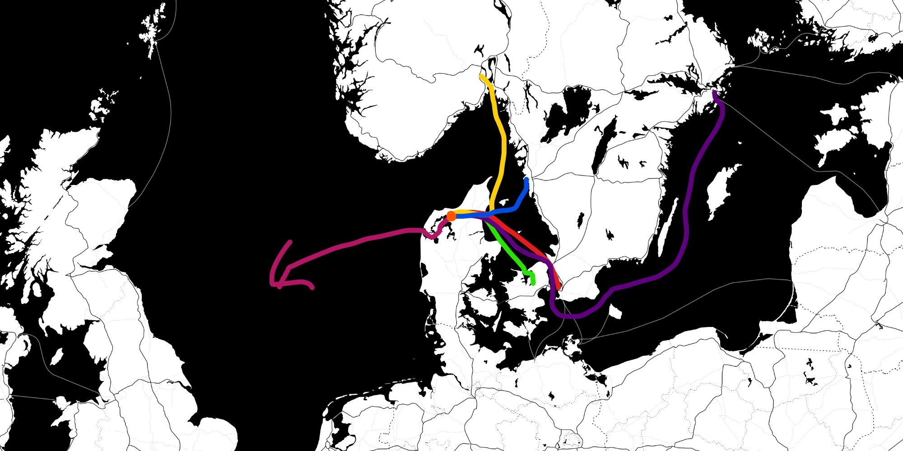
*maps.stamen.com*
]

---
# Descriptive evidence
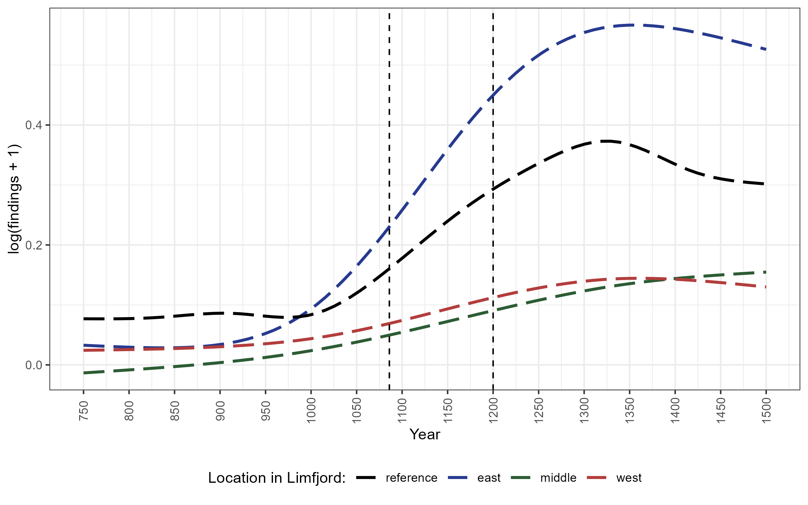
---
name: arch1
**Plot of effect to the likelihood of a coin finding being generated**
```{r echo=FALSE, out.width="80%", fig.align='center'}
knitr::include_graphics("Figures/arch_dummy_coins.png")
```

[More details](#appendixarch); [Matched sample alternative](#matching_coins)

---
name: arch2
**Plot of effect to the likelihood of a building finding being generated**
```{r echo=FALSE, out.width="80%", fig.align='center'}
knitr::include_graphics("Figures/arch_dummy_buildings.png")
```
[More details](#appendixarch); [Matched sample alternative](#matching_buildings)

---
name: other-results
# Conclusion 
.pull-left[
- **RQ:** How are we affected by geography? Does infrastructure cause development?
- Storm led to a channel and improved connectivity in 1834
- The population grew 22 percent in a generation in affected parishes 
- Population growth carried by trade and adaptation
- Intrinsic growth (fertility), fishing and manufacturing
]


.footnote[
**Email**: christian-vs@sam.sdu.dk;<br>
**Twitter**: @Christian Vedel<br>
Feel free to reach out :-)
]

.pull-right[
**Moving forward**
- Quantifying institutions and secondary infrastructure
- Your comments!

<br>
```{r echo=FALSE, out.width="60%", fig.align='center'}
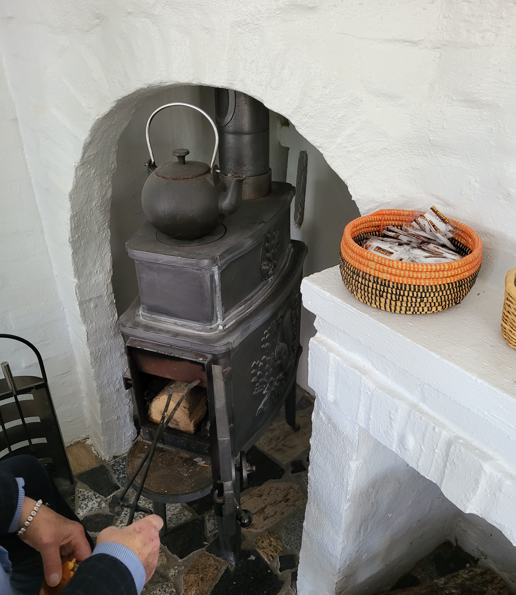
```
*Oven from Morsø Iron foundry. Founded in a Limfjord Market town with British coal and Swedish iron in 1853*
]


---
count: false
class: center, middle
# Appendix

---
name: new-ports
# New ports
[Back](#instmech)
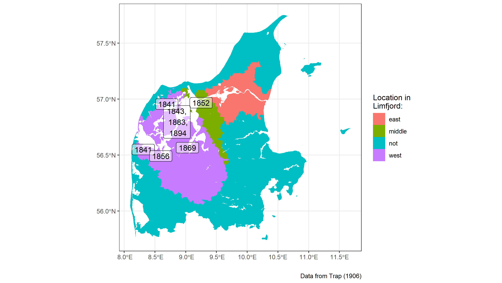

---
name: railways1
# Railways (1/2)
[Back](#instmech)

.pull-left[

]

.pull-right[


]

Source: Fertner (2013)

---
name: railways2
# Railways (2/2)
[Back](#instmech)
.pull-left[
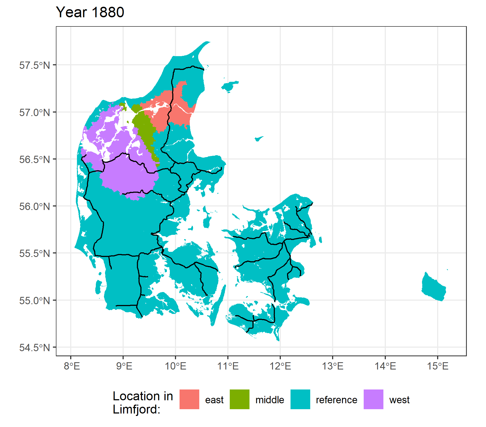
]

.pull-right[

]

Source: Fertner (2013)

---
name: elsinor
# Elsinor


.center[
<iframe src="https://www.google.com/maps/embed?pb=!1m14!1m12!1m3!1d3743.038856836935!2d12.616720634729397!3d56.03904113734528!2m3!1f0!2f0!3f0!3m2!1i1024!2i768!4f13.1!5e1!3m2!1sda!2sdk!4v1655049802848!5m2!1sda!2sdk" width="600" height="450" style="border:0;" allowfullscreen="" loading="lazy" referrerpolicy="no-referrer-when-downgrade"></iframe>
]

[Back to STR](#str-presentation), [Back to results](#str-results)


---
name: Rob_comp
## Robustness: Comparison groups

.pull-left[
#### MA approach
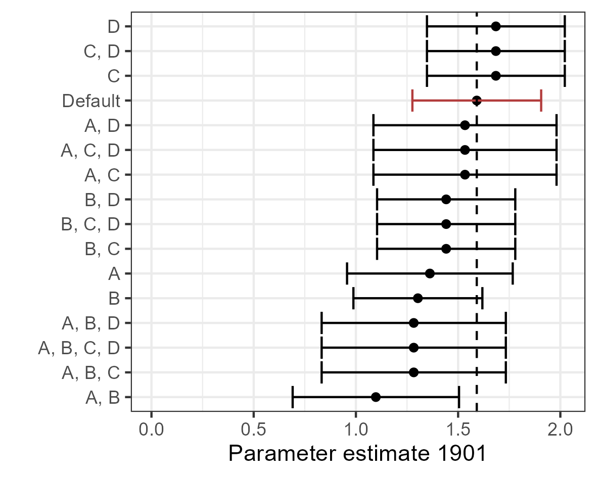
]

.pull-right[
#### Dummy approach
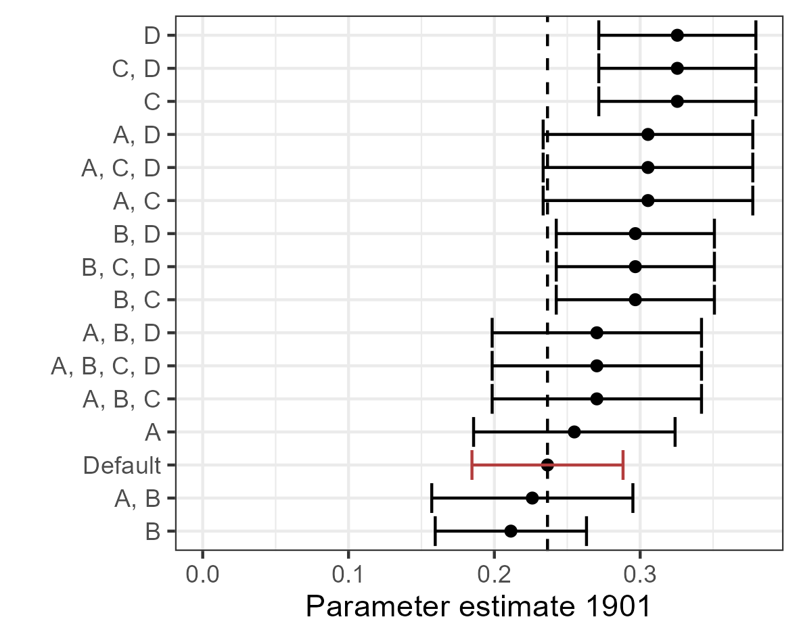
]

[Back](#pop)

.footnote[
**Definitions:** A: <5km to coast; B: Copenhagen excl.; C: Control >100 km from Limfj.; D: <5km to Market town
]


---
name: all-paramMA
## Robustness: Parameter choices

```{r echo=FALSE, out.width="60%", fig.align='center'}
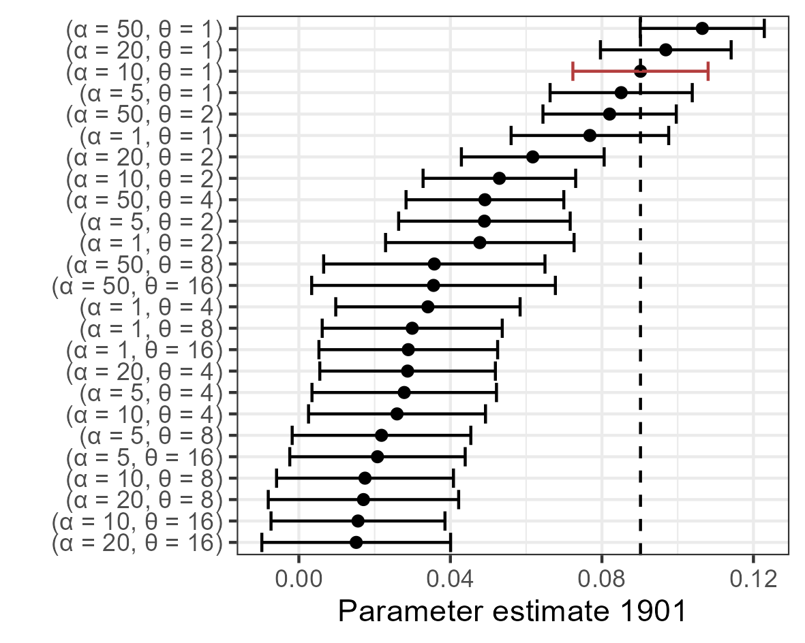
```

[Back](#pop)

---
name: pre_treat_adj
## Robustness: Pre-treat characteristics

.pull-left[
- Using the doubly robust estimator from Callaway & Sant’Anna (2021).
- Combines outcome regression with propensity score method. If either is valid, then the estimator is consistent.
- Only corrects for pre-treatment characteristics

**Columns:** (1): No adj.; (2): Adj. for age, occupation, fertility; (3): Adds log(Pop) as adj.
]

.pull-right[
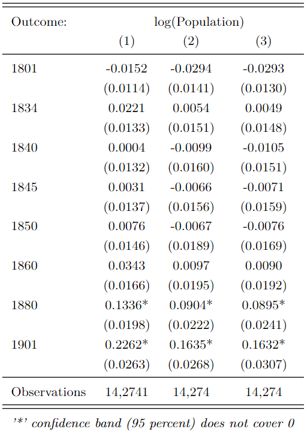
]

[Back](#pop)


---
name: fish
# Environmental impact
[Back](#mechanism1)

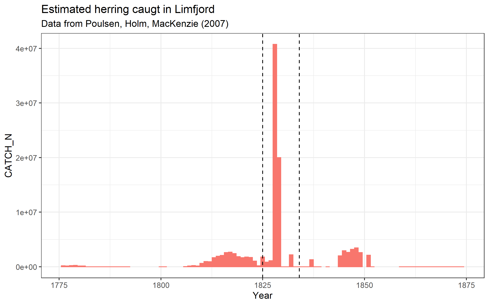

---
name: newspapers
# Newspapers

.pull-left[
- Based on all newspapers in published in the period
]

.pull-right[
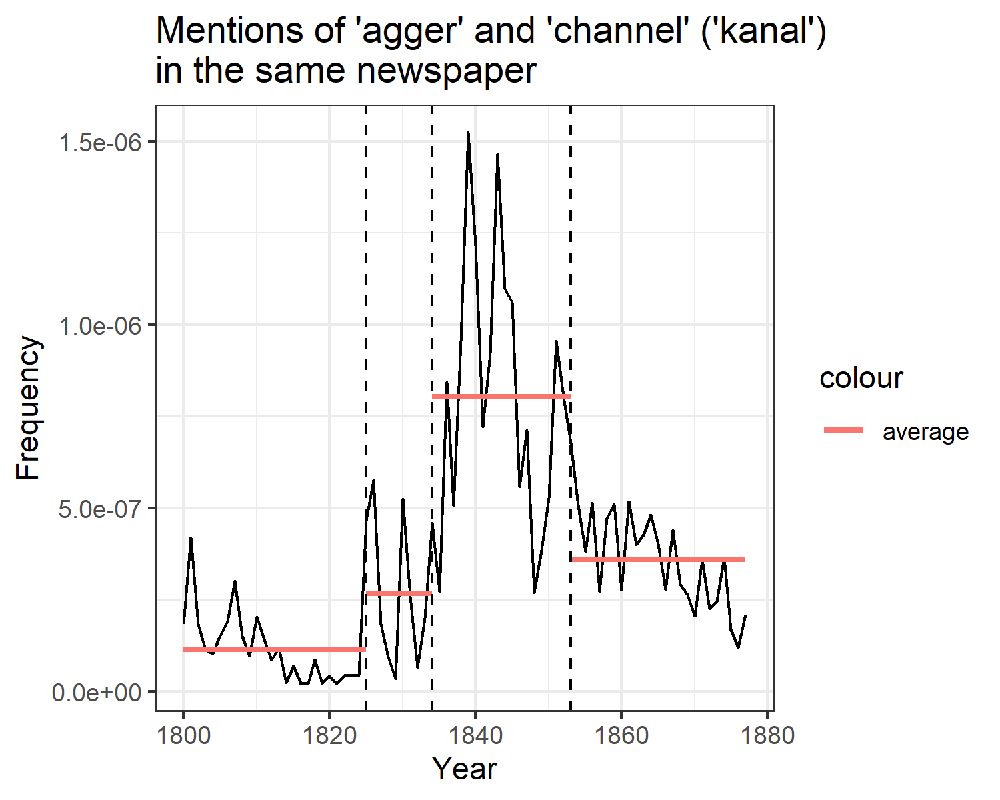
]

---
### Safer, more convenient harbours

*Dangerous loading on the west coast*

---
name: instmech
# Mechanism: Adaptation

.pull-left[
[Back](#mechanism1)  
*Theoretical mystery desribed by Redding and Turner (2015)*

#### Historiography:
- 1840s: [New ports were constructed in all west Limfjord market towns](#new-ports)
- 1841: Independent rights for international trade
- 1852: First ever Danish steam route to England 
- 1856-1861: Construction of the Frederik VII canal at Løgstør 
- 1860-1900: [Railways](#railways1) and highways 
- 1875-1933: Groins to stabilise the channel (and coast) 
]


.pull-right[
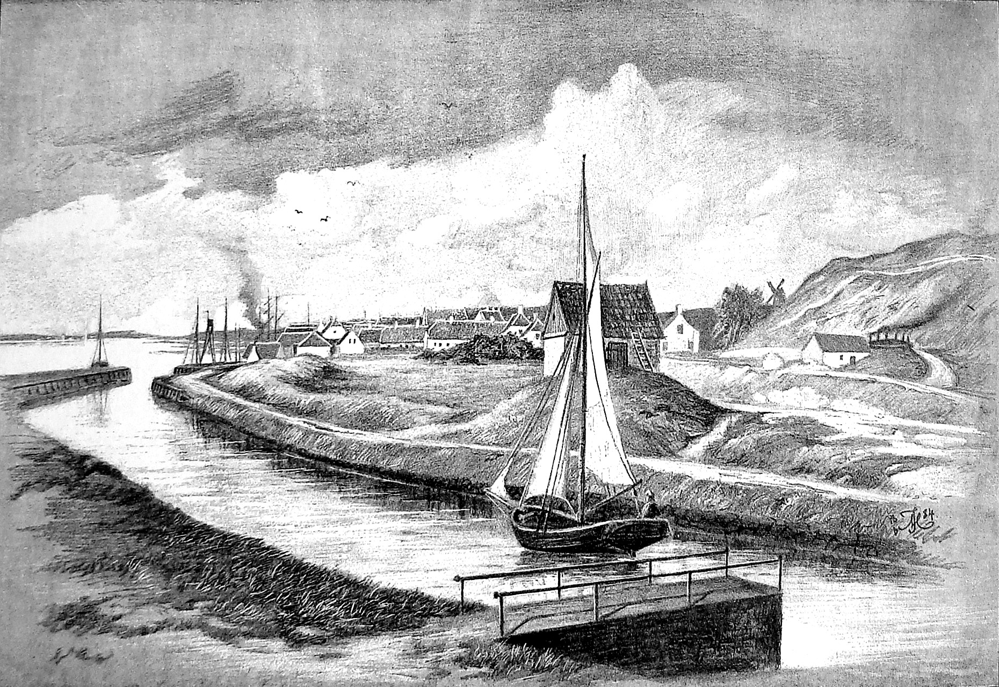
*Milton (1884) Frederik VII canal*

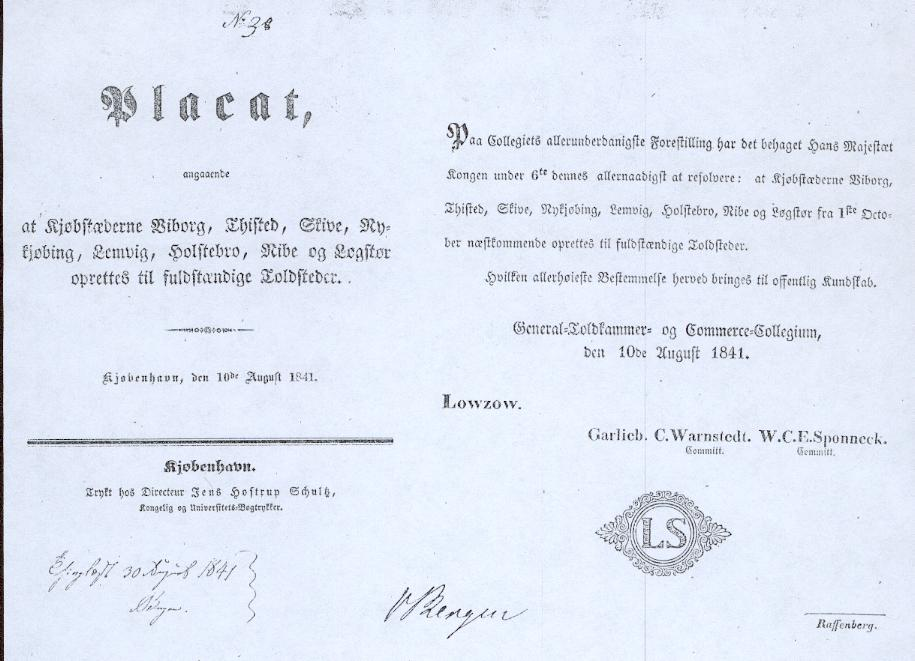
*'Placat' announcing trade rights of Limfjord market towns*
]


---
name: hisco
# New occupational data
[Back](#censusdata)

.pull-left[
- Data censuses 1787-1901 contain occupational for some years (3.7 mio. observations) 
- Training data to train an automatic HISCO-label AI for all 12.4 mio. records. 
- Precision: 97.21%; Recall: 97.07% 
- Separate paper - please let me know if you have data
]

.pull-right[
#### How it is applied here
- Top 100 occupations are manually labelled as 'Fishing' or 'Manufacturing'
- Used in a mediation analysis: Can either explain away the effect of the channel?  
- Manufacturing can! 
]


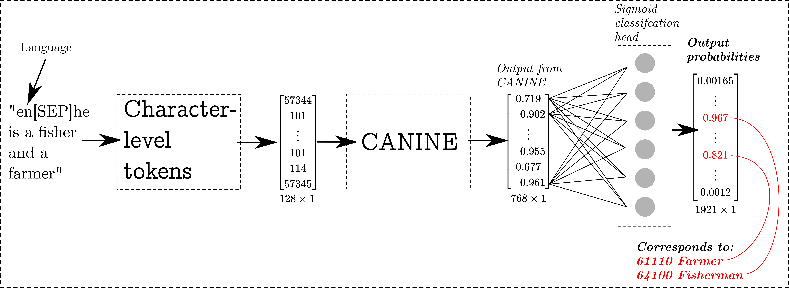

---
class: center, middle
name: appendixarch
# Archaeological evidence details

.footnote[
[Back](#arch)
]

---

.pull-left[
## About the data
- Administrative database of all archaelogical sites and finds 
- Managed by ministry of culture 
- 321 generic types of findings. E.g. coins
- 1940 dated sites with coins between 750 and 1500

- Panel construction:
  + **Innovation:** Monte Carlo to estimate $P_i(Coin|t)$   
  + Probability that a coin finding was generated at a specific time

]

.pull-right[
## Data example


*Coins, wikimedia commons*
]

.footnote[
[Back](#arch)
]

---
# Estimator of coin probability
.pull-left[
- **Objective:** We want to know *how likely it is that coin was left at a particular time $t$*
- **What we have:** Observations of individual coin findings and a distribution of times $t$, which are likely for a specific coin finding in a place $i$ 

**In equation form:**
- What we have: $P_i(t|c)$: Probability of $t$ given one coin 
- What we want: $P_i(\{c\}|t)$: Probability of *any* coins in time $t$
]
--
.pull-right[
### The solution
Bayes formula and Monte Carlo
- Simple to sample from this distribution
- Sample $t$ from each coin 
- Count frequency of coin findings
$$P(\{c\}|t)=\left[1-\prod_{c=1}^{K_i} \left( 1 - P(t|c) \right)\right] P(\{c\})$$
where it is assumed that
$P(t|c)\sim \mathscr{U}(Year_{min}^c; Year_{max}^c)$ or
$P(t|c)\sim \mathscr{N}(\mu_c, \sigma_c),$
$\sigma_c=\frac{(Year_{max}^c - Year_{min}^c)}{1.96}$
]


---
### All indicators 


.footnote[
[Back](#arch)
]
---
name: matching
### Soil type matching
.pull-left[
- Soil types linked to medieval developmental trajectory (Andersen et al, 2016)
- Using common soil types to estimate treatment propensity score with XGBoost 
- Soil from GEUS
- West Limfjord matched to other parishes using greedy matching. 
]

.pull-right[
*Before*
```{r echo=FALSE, out.width="80%", fig.align='center'}
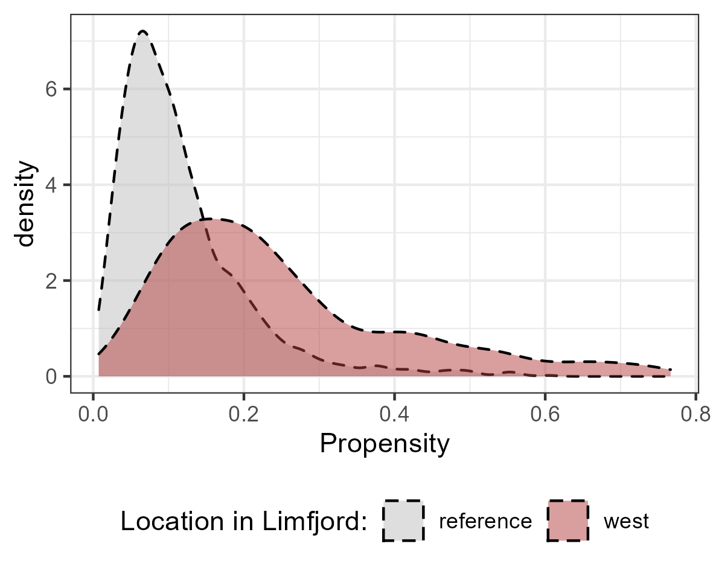
```

*After*
```{r echo=FALSE, out.width="80%", fig.align='center'}
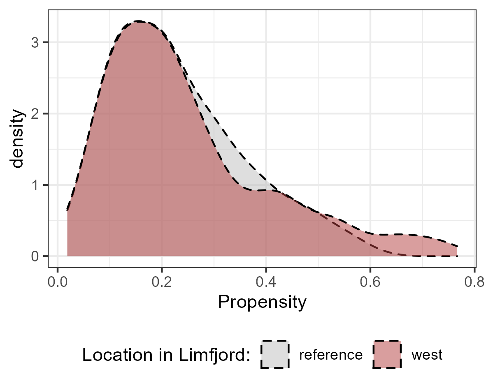
```

]

---
name: matching_coins
#### Coin findings (matched sample)


[Back](#arch1)
---
name: matching_buildings
#### Building findings (matched sample)

[Back](#arch1)
---
### Safer, more convenient harbours

*Dangerous loading on the west coast*
