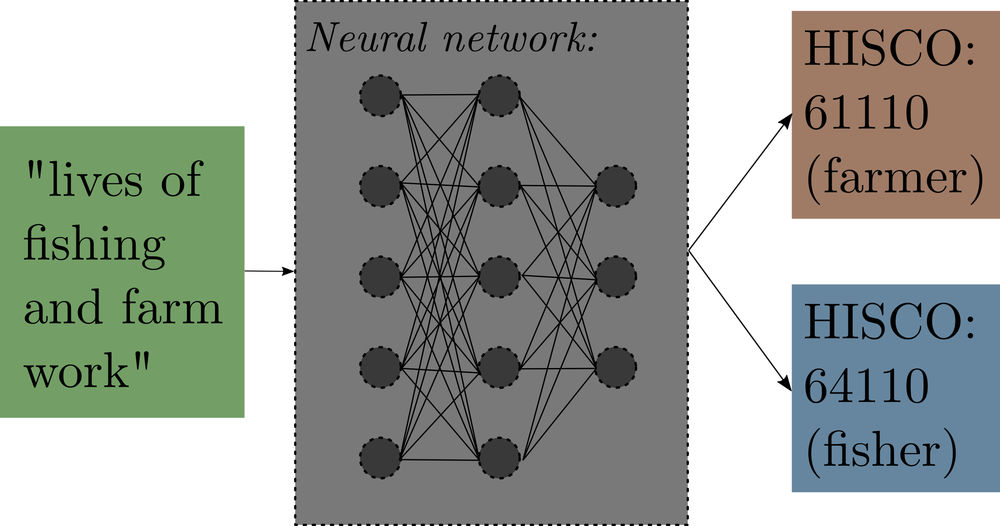
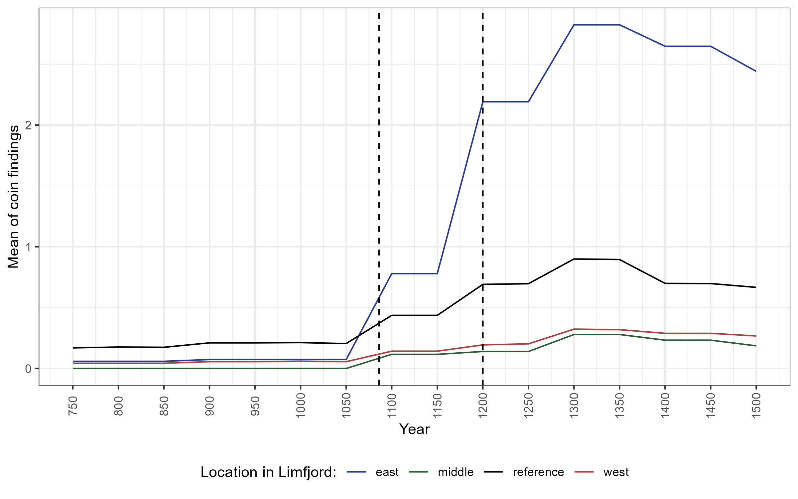

---
output:
  xaringan::moon_reader:
    includes:
      after_body: insert-logo.html
    self_contained: false
    lib_dir: libs
    nature:
      highlightStyle: github
      highlightLines: true
      countIncrementalSlides: false
      ratio: '16:9'
editor_options: 
  chunk_output_type: console
---
class: center, middle, inverse
```{css echo=FALSE}
.pull-left {
  float: left;
  width: 48%;
  text-align: left;
}
.pull-right {
  float: right;
  width: 48%;
  text-align: left;
}
.pull-right ~ p {
  clear: both;
}

.pull-center {
  margin: 0 auto;
  width: 50%;
  text-align: left;
}
.pull-center ~ p {
  clear: both;
}

.pull-center-narrow {
  margin: 0 auto;
  width: 30%;
  text-align: left;
}
.pull-center-narrow ~ p {
  clear: both;
}

.pull-left-wide {
  float: left;
  width: 66%;
  text-align: left;
}
.pull-right-wide {
  float: right;
  width: 66%;
  text-align: left;
}
.pull-right-wide ~ p {
  clear: both;
}

.pull-left-narrow {
  float: left;
  width: 30%;
  text-align: left;
}

.pull-right-narrow {
  float: right;
  width: 30%;
  text-align: left;
}

.tiny123 {
  font-size: 0.40em;
}

.small123 {
  font-size: 0.80em;
}

.medium123 {
  font-size: 1.10em;
}

.large123 {
  font-size: 3em;
}

.huge123 {
  font-size: 6em;
}

.red {
  color: red;
}

.red123 {
  color: #b33d3d;
}

.green123 {
  color: #2c5c34;
}

.highlight {
  background-color: yellow;
}
```

```{css echo=FALSE}
.remark-slide-number {
  display: none;
}
```


.large123[**A Perfect Storm: First-Nature Geography and Economic Development**]

### Christian Vedel, 
### University of Southern Denmark

.pull-center[
.center[
<p><i>These slides + full replication package from raw data to latex and final paper available at </i>
<a href="https://github.com/christianvedels/A_perfect_storm">github.com/christianvedels/A_perfect_storm</a> 

</p>
]
]


---
class: center, middle, inverse
# *Why is it that economic activity happens in some places rather than other places?*

???


---
class: center, middle, inverse

### Distribution of Economic Activity across the world
```{r echo=FALSE, out.width="75%", fig.align='center'}
knitr::include_graphics("Figures/The_earth_at_night_greyscale.png")
```

.small123[
[www.commons.wikimedia.org/wiki/File:The_earth_at_night.jpg](https://commons.wikimedia.org/wiki/File:The_earth_at_night.jpg)  
*Wikimedia Commons, retrieved from NASA Earth Observatory, 27 November 2012*
]

???
- If you are born in certain places, you have worse opportunity 
- Simply loosing the geographical lottery gives you worse opportunities
- Why?

---
class: middle

.pull-left-wide[
# A Perfect Storm
- In 1825 a storm breached the narrow Agger Istmus
- In 1834 it became navigable
- The same event happened in reverse in the 1100s


- Time variation in first-nature geography: Difference-in-difference to study the causal effect of geography on economic development

- **Data:** Population, occupation, demography (fertility/internal migration), archaeological findings $\rightarrow$ **First nature geography determines the location of prosperity**
]

---
class: middle

.center[
# Literature
]

.pull-left[
### Institutions vs geography
- Institutions are the primary driver of economic development (Acemoglu et al., 2001)
- Geography acts through institutions (Rodrik et al., 2004)
- Geography plays a role (which is smaller than instituions) (Ketterer and Rodríguez-Pose, 2018)
]

.pull-right[
### Geography
- Henderson et al. (2018): Geography explain 47 pct of nightlight variation
- Even large disruptions does not change long-run outcomes (Davis and Weinstein, 2002) $\rightarrow$ Path dependence or first nature geography?
- Bleakly and Lin (2012): Path dependence is part of the answer
- What about first nature? Extreme long-run: Diamond (1997); Allen et al. (2023); Matranga (2024)
]

---


---
class: middle
.pull-center[
## This paper
.green123[
.medium123[
*Explores the effects when first-nature geography suddenly changes*
]
.medium123[
*Does first nature matter beyond the origin of path dependence?* 
]
]

]

---
```{r echo=FALSE, out.width="75%", fig.align='center'}

```

???
- This map essentially shows the entire story I am going to tell you today 
- Market access improved because of new port becoming available 
- Imagine being a merchant in one of these dots before 1834 
- You would have to travel along the dotted line

---
class: center
## Map
<iframe src="https://www.google.com/maps/embed?pb=!1m14!1m12!1m3!1d704129.7470425251!2d8.826970647896832!3d56.880787313536544!2m3!1f0!2f0!3f0!3m2!1i1024!2i768!4f13.1!5e1!3m2!1sda!2sdk!4v1634159326111!5m2!1sda!2sdk" width="1200" height="500" style="border:0;" allowfullscreen="" loading="lazy"></iframe>

---
name: timeline
# Timeline

--

#### Pre-event: 
- 1085-1208: Natural western channel closed because of gradual land rises (since the last ice age)
- Limfjord towns lacked far behind the rest of the country

--

#### Event:
- 1825: Breach of Agger Isthmus
- 1834: Ships start consistently passing through a new natural channel 
- 1841: Independent trade rights to west Limfjord market towns 
- 1841-1860: 'Golden age of trade'
- 1860-1900: Population growth + changed occupational structure


???
- This newspaper clip is from a local newspaper 
- It is written with the hard to read 'Fraktur' font
- ...And it is also in Danish 
- But if you trust me, I can tell you that it says that a ship arrived with coal from Newcastle 
- This is the type of traffic which was now possible. 

---
class: middle
# Empirical strategy

.pull-left-narrow[
$$log(y_{it}) = Affected_i \times Year_t \beta_t + FE + \varepsilon_{it}$$
*Affected is:*
- The **West** Limfjord, or
- Improved **market access** after the breach

]

???
- Nicely exogenous event 
- Only concern is how we define being 'affected'

---
```{r echo=FALSE, out.width="75%", fig.align='center'}

```

---
class: middle
# Market Access
.pull-left[
Based on cost distance from parishes to harbours: 
$${MA}_p = \sum_{h \in H} [CostDist(p, h) + 1]^\theta \times W_{p}$$
- CostDist - Dijkstra's algorithm and 1/10 land/sea ratio 
- $\theta = -1$  
]

---
name: censusdata

# Main data: Census data

.pull-left[
- Link Lives 
- Individual-level data for the years 1787, 1801, 1834, 1845, 1860, 1870, 1890 and 1901 
- From this: Parish level population counts + occupations + other demographic info
- New procedure to automatically make [HISCO labels](#hisco) - [OccCANINE](https://github.com/christianvedels/OccCANINE) [arxiv.org/abs/2402.13604](https://arxiv.org/abs/2402.13604)


]

.pull-right[
*Census, wikimedia commons*


]

---
class: center, middle

# First nature geography causes trade
```{r echo=FALSE, out.width="75%", fig.align='center'}
knitr::include_graphics("Figures/Ship_trafic.png")
```
*Descriptive statistics from Sound Toll Registers*

---
class: center, middle
# Population increase

.pull-left[
### Market Access approach
```{r echo=FALSE, out.width="100%", fig.align='center'}
knitr::include_graphics("Figures/pop_ma.png")
```

]

.pull-right[
### Dummy approach
```{r echo=FALSE, out.width="100%", fig.align='center'}

```

]

???
- Rauch & Maurer (2022): 2.3 for panama canal

---
class: middle

.pull-left[
## Results
#### In 1901:
- **Dummy approach:** 0.236 log points (26.7 percent) population growth 
- **Market Access approach:** 1.59 elasticity of first-nature market access to population size

]


---
class: center
# Occupational effect in 1901 (1/2)

.pull-left[
```{r echo=FALSE, out.width="90%", fig.align='center'}

```

]
.pull-right[

### Results

- Shift in occupational structure. 
- Most remarkable for Argiculture and Manufacturing

.middle[
.small123[
#### Econometrics details
- **HISCO coding?:** *OccCANINE* [arxiv.org/abs/2402.13604](https://arxiv.org/abs/2402.13604)
- **Small changes?:** APE share: *Average partial effects as share of population*  
  + *Answers changes to how common a profession is in a parish's population*
- **Zeros?** Extensive + Intensive margin + asinh(x) + log(x+1) (Chen & Roth, 2023)
- **Multiple testing:** Bonferoni correction
]
]
]


???

---
class: center
# Occupational effect in 1901 (2/2)

.pull-left-narrow[
- Spinners
- Generic workers (factories)
- Fishermen
- Farmers (as default)

]

.pull-right-wide[
```{r echo=FALSE, out.width="90%", fig.align='center'}

```

]

---
class: center

.pull-left[
### Born in differen county
#### Dummy approach
```{r echo=FALSE, out.width="50%", fig.align='left'}

```

#### MA approach
```{r echo=FALSE, out.width="50%", fig.align='left'}

```

]
--
.pull-right[
### Child/woman ratio
#### Dummy approach
```{r echo=FALSE, out.width="50%", fig.align='left'}

```

#### MA approach
```{r echo=FALSE, out.width="50%", fig.align='left'}

```

]

---
class: center, middle, inverse

# What about external validity?


---
# The reverse natural experiment

.pull-left-wide[ 
- The Limfjord also had a western opening in the Viking age. 
- Ideal hub for viking fleets heading west towards England (Matthiessen 1941; Rasmussen, 1966) 
- Northwestern Denmark in 1100s is very different from ditto in 1800s
- Between 1086 and 1208 the channel closed up (historical + geological sources)

**Data?** 
- Just use register data! 
- Turning dating range + coordinate into panel of economic activity
]

.pull-right-narrow[

*'Overseas Guests', Roerich (1901)*

*maps.stamen.com*
]

---
# Descriptive evidence
```{r echo=FALSE, out.width="75%", fig.align='center'}

```

---
class: middle
.center[
## Effect on coin findings
]

.pull-left-wide[
```{r echo=FALSE, out.width="75%", fig.align='center'}

```
]

.pull-right-narrow[
- The West Limfjord region falls behind, when their channel closes
- Completely due to geomorphology and determined in the last ice age 
- Details of panel construction and more results in the paper
]


---
name: other-results
# Conclusion 
.pull-left[
- **Does first nature influence development beyond eventual path dependence? Yes**
- Storm led to a channel and improved connectivity in 1834
- The population grew 26.7 percent in a generation in affected parishes 
- Intrinsic growth (fertility), fishing and manufacturing
- (Temporal) external validity: Closing of similar channel in 1200 $\rightarrow$ Similar (reverse) effect
]


.footnote[
**Email**: christian-vs@sam.sdu.dk;<br>
**Twitter/X**: @Christian Vedel<br>
Feel free to reach out :-)
]

.pull-right[


]